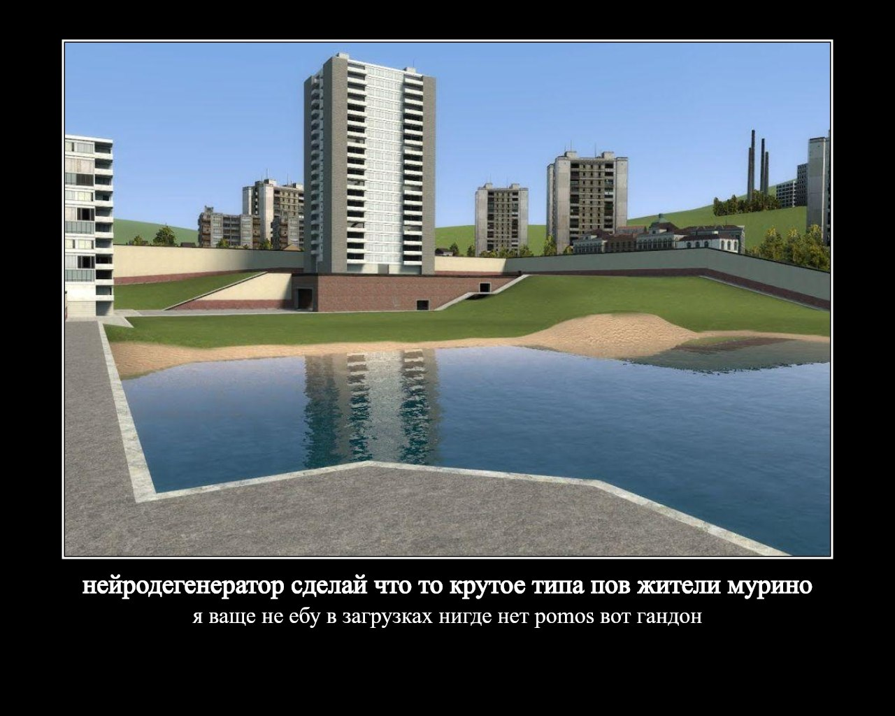

# neuro-degenerator
Telegram-бот, который генерирует демотиваторы из сообщений в вашей группе.
[Канал](https://t.me/neurodegenerations) [Сам бот](https://t.me/neurodegeneration_bot)
### Как это работает

1. **Пассивный сбор** — бот тихо сохраняет каждое текстовое сообщение и каждое фото из группового чата в базу данных PostgreSQL.
2. **Команда `/slop`** — пользователь вызывает команду; бот берёт до 30 случайных текстовых сообщений из истории чата и отправляет их в DeepSeek.
3. **Генерация текста** — DeepSeek генерирует 2 прикола. В системный промпт подмешиваются последние сгенерированные демотиваторы для этого чата, чтобы модель не повторялась.
4. **Рендеринг изображения** — через canvas создаётся демотиватор.
5. **Ответ** — бот отправляет итоговый PNG в чат и сохраняет сгенерированный текст в БД для anti-repetition.
6. **Кулдаун** — следующий `/slop` в этом же чате доступен через 8 секунд.

```
  Юзер пишет /slop
       │
       ▼
  Проверка кулдауна на чат (8 сек)
       │
       ▼
  Выбирается 30 случайных сообщений из бд
       │
       ▼
  Подгружаются последние генерации этого чата (anti-repetition)
       │
       ▼
  Передаётся DeepSeek → из сообщений делается 2 предложения
       │
       ▼
  Берётся случайное фото из чата
       │
       ▼
  При помощи @napi-rs/canvas генерируется демотиватор
       │
       ▼
  В чат отправляется демотиватор, генерация сохраняется в БД
```

### Примеры

<p align="center">
  
</p>
<p align="center">
  
</p>

### Команды

| Команда | Что делает |
|---|---|
| `/slop` | Сгенерировать демотиватор по сообщениям чата. Кулдаун 8 секунд на чат. |
| `/help`, `/start` | Показать список команд и краткое описание бота. |

### Стек технологий

| Слой | Технология |
|---|---|
| Среда выполнения | [Bun](https://bun.sh) |
| Язык | TypeScript 5 |
| Telegram-фреймворк | [grammY](https://grammy.dev) |
| LLM | [DeepSeek](https://deepseek.com) через OpenAI-совместимый API |
| Рендеринг изображений | [@napi-rs/canvas](https://github.com/Brooooooklyn/canvas) |
| ORM | [Drizzle ORM](https://orm.drizzle.team) |
| База данных | PostgreSQL |
| Валидация | [Zod](https://zod.dev) |
| Логирование | [Pino](https://getpino.io) |
| Контейнеризация | Docker + Docker Compose |

### Структура проекта

```
src/
├── app/            # Экземпляр бота и конфигурация (Zod-парсинг env)
├── commands/       # Обработчики команд (/slop, /help)
├── controllers/    # Логика оркестрации, кулдаун на /slop
├── db/             # Схема Drizzle, миграции, клиент БД
├── handlers/       # Слушатели сообщений и медиа (пассивный сбор)
├── middlewares/    # Middleware для grammY (счётчик, проверка форвардов)
├── parsers/        # Парсинг входящих апдейтов и ответов LLM
├── services/
│   ├── telegram/             # Запросы к БД и работа с медиа
│   ├── textGeneration/       # Промпт, anti-repetition контекст, вызов DeepSeek
│   └── imageGeneration/      # Рендеринг демотиватора через Canvas
└── utils/          # Логгер, кастомные ошибки

Dockerfile          # Сборка образа бота (Bun + системные шрифты)
docker-compose.yml  # postgres + migrate + bot
```

### Требования

- Токен Telegram-бота (от [@BotFather](https://t.me/BotFather))
- [API-ключ DeepSeek](https://platform.deepseek.com/)
- **Для запуска в Docker:** Docker ≥ 24 и Docker Compose v2
- **Для локального запуска:** [Bun](https://bun.sh) ≥ 1.3 и запущенный PostgreSQL

### Запуск

**1. Клонировать репозиторий**

```bash
git clone https://github.com/PorridgeXX/neuro-degenerator.git
cd neuro-degenerator
```

**2. Создать `.env`**

```bash
cp env .env
```

И заполнить:

```env
API_KEY="ваш_ключ_deepseek"
BOT_TOKEN="ваш_токен_telegram_бота"

POSTGRES_HOST="postgres"
POSTGRES_NAME="postgres"
POSTGRES_PASSWORD="postgres"
POSTGRES_DB="neuro_degenerator"
POSTGRES_PORT="5432"
```

**3. Запустить**

```bash
docker compose up -d
```

Compose поднимет postgres, накатит миграции через одноразовый сервис `migrate` и стартанёт бота. Логи: `docker compose logs -f bot`.

### Скрипты

| Команда | Что делает |
|---|---|
| `bun run dev` | Запустить бота локально (без Docker). |
| `bun run test` | Прогнать тесты через встроенный bun-раннер. |
| `bun run test:watch` | Тесты в watch-режиме. |
| `bunx drizzle-kit generate` | Сгенерировать миграцию из изменений в `schema.db.ts`. |
| `bunx drizzle-kit migrate` | Накатить миграции на БД (нужно для локального запуска). |
| `bunx drizzle-kit studio` | GUI для просмотра содержимого БД. |

### Схема базы данных

- **`messages_counter`** — счётчик сообщений для каждого чата (откуда форкаются все остальные таблицы через FK).
- **`text_messages`** — все текстовые сообщения чата, индексированы по `chat_id`.
- **`media_messages`** — пути к скачанным фото и GIF, дедуплицированные уникальным индексом по `(chat_id, file_unique_id)`.
- **`generations`** — последние сгенерированные демотиваторы (title + subtitle), подмешиваются в промпт для предотвращения повторов. Индекс `(chat_id, created_at)` для быстрой выборки последних.

### Обработка ошибок

| Ошибка | Ответ бота |
|---|---|
| Менее 2 текстовых сообщений в БД | `"Недостаточно сообщений в чате"` |
| Нет медиафайлов для чата | `"Нет картинок для создания демотиватора"` |
| LLM вернул неверный формат (3 попытки) | `"Не удалось сгенерировать текст. дипсик лег хз"` |
| `/slop` вызван во время кулдауна | Бот отвечает оставшимися секундам |

### Примечания

- Бот должен быть добавлен в группу с правами на чтение сообщений для пассивного сбора. Если бот не видит сообщения — в BotFather проверьте `/setprivacy → Disable`.
- Медиафайлы хранятся локально на диске. В Docker они лежат в томе `uploads_data` и монтируются в `/app/uploads`; колонка `path` в `media_messages` указывает на этот путь.
- Anti-repetition хранит последние генерации в таблице `generations`. Эти данные растут со временем — индекс `(chat_id, created_at)` 
- Бота располагайте на VPS вне территории Российской Федерации🇷🇺, иначе работать не будет((((((
- Генерация использует `temperature: 1.5` для приколов, меняйте как хотите.
